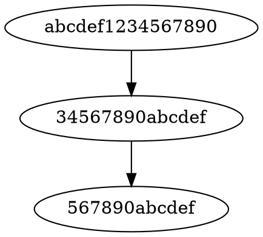

# Graph Representation Project

This project is designed for visualizing dependency graphs using Graphviz. It represents nodes and their connections in a diagram format.

## Contents

- [Description](#description)
- [Requirements](#requirements)
- [Installation](#installation)
- [Usage](#usage)
- [Example](#example)
- [Testing](#testing)
- [License](#license)

---

## Description

The project implements a simple mechanism for displaying dependency graphs using Graphviz. You can create nodes, link them, and visualize the graph as a convenient diagram.

## Requirements

To run and successfully use the project, you will need:

- Python 3.12.8
- Installed packages:
  - `pyparsing`
  - `pytest`
  - `PyYAML`
  - `pip`
- Graphviz (installed locally and added to the system PATH)

## Installation

1. Clone the repository:
   ```sh
   git clone <repository-URL>
   ```

2. Navigate to the project directory:
   ```sh
   cd <directory-name>
   ```

3. Install all necessary dependencies:
   ```sh
   pip install -r requirements.txt
   ```
   Ensure all required packages are listed in `requirements.txt`.

## Usage

Run the script with the following syntax:
  ```bash
  python script.py <graphviz_path> <package_name> <depth>
  ```

- **`<graphviz_path>`**: Path to the Graphviz executable.
- **`<package_name>`**: Name of the package to visualize.
- **`<depth>`**: Depth of the graph to visualize.

## Example

Example Graphviz DOT file generated by the project:


This code creates a simple graph with nodes and connections.

The generated diagram will look like this:
```
abcdef1234567890 ---> 34567890abcdef ---> 567890abcdef
```

To render the diagram, use the following Graphviz command:
```sh
dot -Tpng -o output.png generated.dot
```

## Testing


## Results


## License

This project is distributed under the [MIT License](LICENSE).
